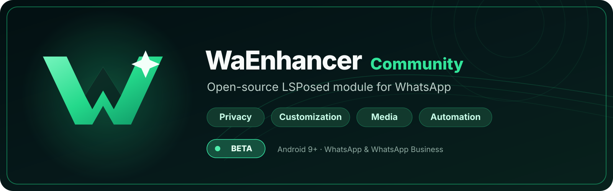

  

  
  
  
  
  

  <strong>Privacy, customization, media tools and automation for WhatsApp — fully open source.</strong>

WaEnhancer Community is an independent **LSPosed/Xposed module for Android** that extends WhatsApp and WhatsApp Business without replacing the original apps. It adds privacy controls, interface customization, media and messaging tools, automation, and quality-of-life features directly to the installed WhatsApp client.

> [!IMPORTANT]
> WaEnhancer Community is not affiliated with, endorsed by, or supported by WhatsApp or Meta. WhatsApp updates can change internal APIs without notice, and using runtime modifications may carry stability or account risks.

## Project status

The project is currently in **beta-stage development**. The core Community architecture and the main feature set are in place; current work is focused on compatibility, regression testing, and polishing the public release experience.

Feature availability can vary by WhatsApp build. WaEnhancer performs runtime compatibility checks before installing core hooks, and incompatible features are isolated when possible instead of assuming that every nearby WhatsApp version is safe.

## Features

| | |
| --- | --- |
| **Privacy & control** | Anti-revoke for messages and statuses, stealth read/status viewing, hide typing or recording indicators, freeze last seen, call and per-contact privacy controls. |
| **Customization** | Floating bottom bar, Liquid Glass surfaces, colors and themes, wallpapers, home-screen and tab controls, toolbar, bubble, timestamp, and status presentation options. |
| **Media & messaging** | View-once controls and downloads, status/media downloads, media quality options, edited/deleted message history, video-note tools, and call recording. |
| **Automation & tools** | Tasker integration, Quick Settings toggles, settings backup/restore, local diagnostics, update checks, and convenience actions. |

The app exposes many individual toggles inside each category. This README intentionally describes the major capabilities rather than duplicating the changelog.

## Requirements

- **Android 9 (API 28) or newer**
- A rooted device with **LSPosed** or another compatible Xposed environment
- **WhatsApp** (`com.whatsapp`) or **WhatsApp Business** (`com.whatsapp.w4b`)
- A WhatsApp build that passes the module's compatibility checks

Because WaEnhancer hooks WhatsApp internals, compatibility is tied to the installed WhatsApp version rather than Android alone.

## Installation

1. Install and configure LSPosed on the rooted device.
2. Download the WaEnhancer Community APK from this repository's [GitHub Releases](https://github.com/igorcv88/WaEnhancerXCommunity/releases).
3. Install the APK and enable **WaEnhancer Community** in LSPosed.
4. Accept the recommended scope and make sure the WhatsApp package you use is enabled.
5. Force-stop and reopen WhatsApp, then open WaEnhancer Community to configure the features you want.

Official public binaries are distributed only through this repository. **If the Releases page is empty, there is no signed public release for that revision yet.** Avoid APK mirrors or repackaged builds.

## Compatibility

WhatsApp changes its internal classes, methods, and layouts frequently. A feature that works on one build may need to be disabled or updated on the next one.

The companion app shows validated WhatsApp versions, while the hooked process can evaluate newer WhatsApp 2.x builds at runtime before enabling the core feature loader. A successful compatibility check means the required contracts were found; it does not guarantee that every UI behavior has been regression-tested on that exact build.

When reporting a compatibility problem, include the Android version, WhatsApp version, LSPosed version, and the relevant WaEnhancer diagnostics. Do not include message contents, phone numbers, tokens, or other personal data.

## Privacy and security

The Community fork is designed to keep diagnostics local and auditable. It does not use Firebase Analytics or Crashlytics, and the executable module code is built from this repository.

For the project policies and technical model, see:

- [Privacy policy](PRIVACY.md)
- [Security policy](SECURITY.md)
- [Architecture](ARCHITECTURE.md)

## Contributing

Bug reports, compatibility findings, documentation improvements, and pull requests are welcome. Use the repository's [Issues](https://github.com/igorcv88/WaEnhancerXCommunity/issues) for reproducible bugs or feature proposals.

Changes that touch WhatsApp hooks should fail safely when a resolver is unavailable and should avoid turning a single incompatible feature into a process-wide failure.

## License and attribution

WaEnhancer Community is licensed under the **GNU General Public License v3.0**. See [LICENSE](LICENSE) and [NOTICE](NOTICE).

This is an independent community fork based on WaEnhancer. Upstream attribution is preserved, and the project must not be presented as an official WhatsApp, Meta, or upstream-maintainer release.
